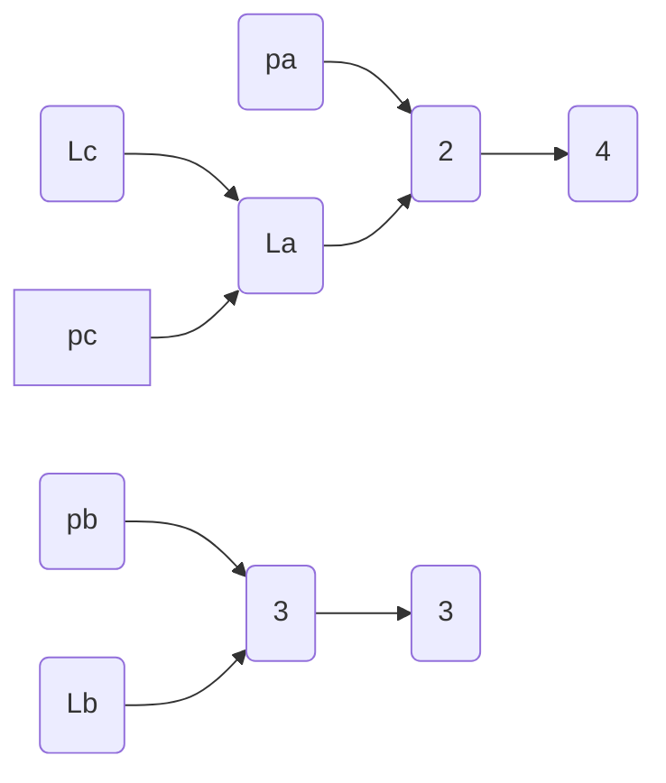
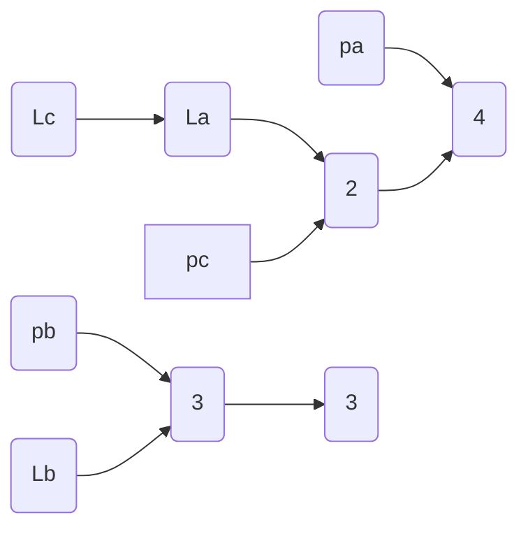
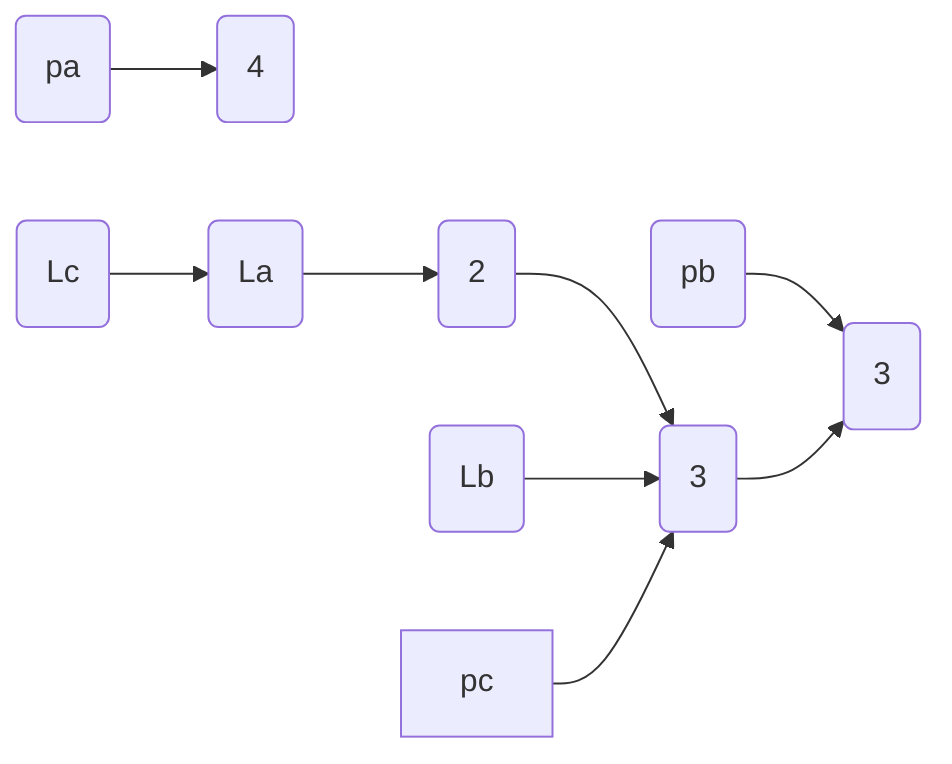
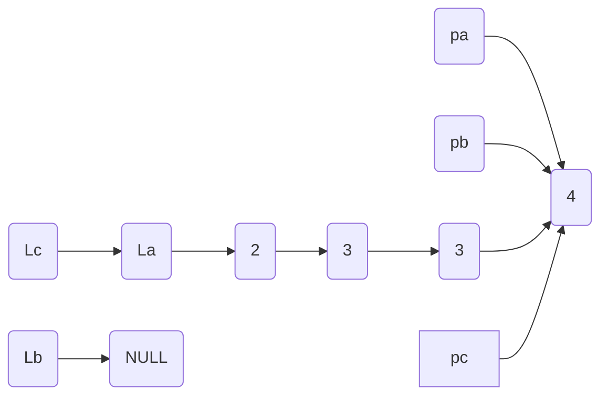

# 非降序链表实验报告


## 实验目的

本次实验旨在巩固所学链表的相关知识，认识到使用链表的重要性和方便性，加深对数据结构和算法的认识，练习和熟悉数据结构在编程里面所承担的角色。


## 实验内容

已知两个**非降序**的链表序列 **$M_1$** 和 **$M_2​$**, 请构造出它们**合并后**的**非降序链表**。


## 输入输出说明

* **输入**：用户要先指定每一个**链表数组**里元素的**个数**，然后对两个链表 **$M_1$** 和 **$M_2$** 分别输入链表里面的数字。    	   输入链表数字的时候，按**列**的方式输入数字，即每次输入都要按回车。

* **输出**：程序运行后，按**列**的形式**由小到大**输出每一个链表元素里的**数字**。

* **示例**：

  > **输入**：请输入链表集合里面元素的个数:  3	(用户指定第一个链表里元素的个数)
  >
  > ​            请写下该链表的第1个元素:  1		  (用户输入每一个数字) 
  >
  > ​	    请写下该链表的第2个元素:  3
  >
  > ​	    请写下该链表的第3个元素:  5
  >
  > ​	    请输入链表集合里面元素的个数:  4	(用户指定第二个链表里元素的个数)
  >
  >    	 请写下该链表的第1个元素:  2		 (用户输入每一个数字) 
  >	
  >    	 请写下该链表的第2个元素:  4
  >
  > ​	    请写下该链表的第3个元素:  6
  >
  > ​    	请写下该链表的第4个元素:  8
  >
  > 
  >
  > **输出**：1 2 3 4 5 6 8	(按数字由小到大排列输出)

  

## 解题思路

**用户输入数字**和**系统输出数字**这两个问题比较简单，我采用的是建立一个**单链表**。通过遍历单链表来让程序输出数字，输入方面采用**for循环**来实现。

比较复杂的是**比较链表元素**和**合并链表**这两个问题。

我给每一个链表都再添加上了一个**头指针**，分别为**La**和**Lb**，同时为了方便，又引入了第三个链表，它的头指针为**Lc**。

为了解决元素比较后插入的问题，我设立了三个指针**pa**、**pb**、**pc**。其中**pa**和**pb**分别指向**La**表和**Lb**表中当前待比较插入的结点，**pc**指向**Lc**表中当前的最后一个结点。如果 **`pa->number <= pb->number`** , 就将**pa**所指的结点链接到**pc**的结点之后，否则就将**pb**所指的结点链接到**pc**之后。

再者，我们要考虑如果一个链表为**空链表**的情况，这种情况可以使用一个判断语句来解决；最后是两个链表**长度不一样**的问题，这就必然表示有一方先归并完，因此直接使用**三元运算符**将链表剩下的元素插入到**pc**所指的结点以后就可以了。

具体实现过程如图：（在这里我使用**La**的**头结点**作为**Lc**的头结点。）



在比较A链表和B链表的第一个元素了以后，由于A链表的第一个元素比B链表的第二个元素要小，因此合并链表的下一个元素应该为2，同时，**pa**应该右移、**pc**应该指向2所在的链表、**pb**保持不变: 



接着再比较此时**pa**和**pb**所指向的值，知道`pa->number < pb->number`，于是将合并的链表与**3对应的链表**连接起来，**pc**要指向**3对应的链表**、**pa**保持不变，同时**pb**右移一位：



最后再比较4和3，重复刚刚的步骤即可 (最后最好把**Lb**释放了)：



大致步骤就是这样子。


## 实验代码以及注释

- **List.h** 头文件

  在 **list.h** 头文件里面创建了链表的结构体，并且定义了一些公共接口。

  ```c
  //
  //  list.h
  //
  
  #ifndef list_h
  #define list_h
  
  #include <stdio.h>
  #include <stdlib.h>
  
  typedef struct List List;
  
  /**
   * 创建了一个 List 的结构体
   * 这是一个单链表，功能比较简单
   */
  struct List {
      int number;  // 储存一个数字
      List *next;  // 指向下一个List的指针
  };
  
  /**
   * 开放的公共接口
   */
  List* init_List(List* list_first, List* list_previous, List* list_current);  // 允许用户自定义链表
  void print_List(List* list_first, List* list_previous, List* list_current); // 打印出链表里的数字
  void get_final_list(List *list1, List *list2, List *list3, List *list3_previous);  // 直接输出合并、排序后的链表
  List* sorted_List(List* La, List* Lb, List* Lc);  // 对传入的两个链表进行合并和排序，返回合并以后链表的头指针
  
  #endif /* list_h */
  ```


- **list.c** 源文件

  公共接口的实现在 **list.c** 源文件里面。

  ```c
  //
  //  list.c
  //  链表合并习题
  //
  
  #include <stdlib.h>
  #include <stdio.h>
  #include "list.h"
  
  
  /**
   * 初始化链表的代码
   */
  List* init_List(List* list_first, List* list_previous, List* list_current) {
      printf("请输入链表集合里面元素的个数: ");
      int numberOfList_one = 0; // 链表里面的个数变量
      scanf("%d", &numberOfList_one);  // 让用户输入链表里面有多少个数字
      
      for (int i = 0; i<numberOfList_one; i++) {
          // 开始创建第一个链表
          list_current = (List*)malloc(sizeof(List));
          
          // 处理空链表的情况
          if (list_first == NULL) {
              list_first = list_current;
          }
          if (list_previous != NULL) {
              list_previous->next = list_current;
          }
          
          printf("请写下该链表的第%d个元素: ", i + 1);  // 让用户输入填充的数字
          scanf("%d", &list_current->number);
          
          list_current->next = NULL;
          list_previous = list_current;
      }
      // printf("%d\n",list_first->number); // 测试使用接口
      return list_first;
  }
  
  
  /**
   * 打印出数字, 可作为测试使用的接口
   */
  void print_List(List* list_first, List* list_previous, List* list_current) {
      while (list_current != NULL) {
          printf("%d ",list_current->number);
          list_previous = list_current;
          list_current = list_current->next;
          free(list_previous);
          list_previous = NULL;
      }
      list_first = NULL;
      printf("\n");
      return;
  }
  
  /**
   * 输出排序以后链表里的数字
   */
  void get_final_list(List *list1, List *list2, List *list3, List *list3_previous){
      List* La = (List*)malloc(sizeof(La));
      La->next = list1;
      
      List* Lb = (List*)malloc(sizeof(Lb));
      Lb->next = list2;
      
      List* Lc = (List*)malloc(sizeof(Lc));
      Lc->next = list3;
  
      Lc = sorted_List(La, Lb, Lc);
      
      print_List(list3, list3_previous, Lc->next);
  }
  
  /**
   * 最重要的排序算法
   */
  List* sorted_List(List* La, List* Lb, List* Lc) {
      List *pc = NULL;
      pc = La;
      Lc = La;
      
      List *pa = La->next;
      List *pb = Lb->next;
      
      while (pa && pb) {
          if (pa->number <= pb->number) {
              pc->next = pa;
              pc = pa;
              pa = pa->next;
          } else {
              pc->next = pb;
              pc = pb;
              pb = pb->next;
          }
      }
      pc->next = pa ? pa: pb;
      free(Lb);
      
      return Lc;
  }
  ```


- **main.c** 文件

  ```c
  //
  //  main.c
  //  链表合并习题
  //
  
  /********************************************************
   注意事项：本题认为用户输入的数默认为由小到大排列。
   输入：  请输入链表集合里面元素的个数:  3	  (用户指定第一个链表里元素的个数)
  		请写下该链表的第1个元素:  1		  (用户输入每一个数字) 
  		请写下该链表的第2个元素:  3
  		请写下该链表的第3个元素:  5
  		请输入链表集合里面元素的个数:  4	    (用户指定第二个链表里元素的个数)
  		请写下该链表的第1个元素:  2		  (用户输入每一个数字)
  		请写下该链表的第2个元素:  4
  		请写下该链表的第3个元素:  6
  		请写下该链表的第4个元素:  8
  		
   输出：1 2 3 4 5 6 8	(按数字由小到大排列输出)
   ********************************************************/
  
  #include <stdio.h>
  #include <stdlib.h>
  #include "list.h"
  
  int main(int argc, const char * argv[]) {
      
      /* 这是第一个链表的指针 */
      List *list_one_first = NULL;
      List *list_one_current = NULL;
      List *list_one_previous = NULL;
      
      /* 这是第二个链表的指针 */
      List *list_two_first = NULL;
      List *list_two_current = NULL;
      List *list_two_previous = NULL;
      
      /* 调用公共接口，初始化两个基础链表 */
      list_one_first = init_List(list_one_first, list_one_previous, list_one_current);
      list_two_first = init_List(list_two_first, list_two_previous, list_two_current);
      
      printf("\n");
      list_one_current = list_one_first;
      list_two_current = list_two_first;
  
      
      /**
       * 我们需要第三个链表来作为代理，方便我们操作代码
       */
      List *list_three_first = NULL;
      List *list_three_previous = NULL;
      
      /* 在函数内部合并、排序，最后输出结果 */
      get_final_list(list_one_first, list_two_first, list_three_first,list_three_previous);
      
      return 0;
  }
  
  ```

  

## 实验运行结果截图


## 实验收获总结

通过这次实现，深入了解了链表的相关知识，明白了结构体在自定义类型中的重要性，同时也懂得在编码里面多加思考数据结构和算法之类的思想，掌握了和链表有关系的基本数据结构，对以后的编程生涯有较大的益处。

 

